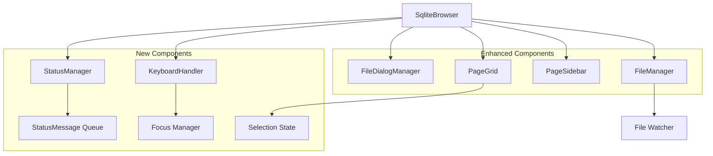
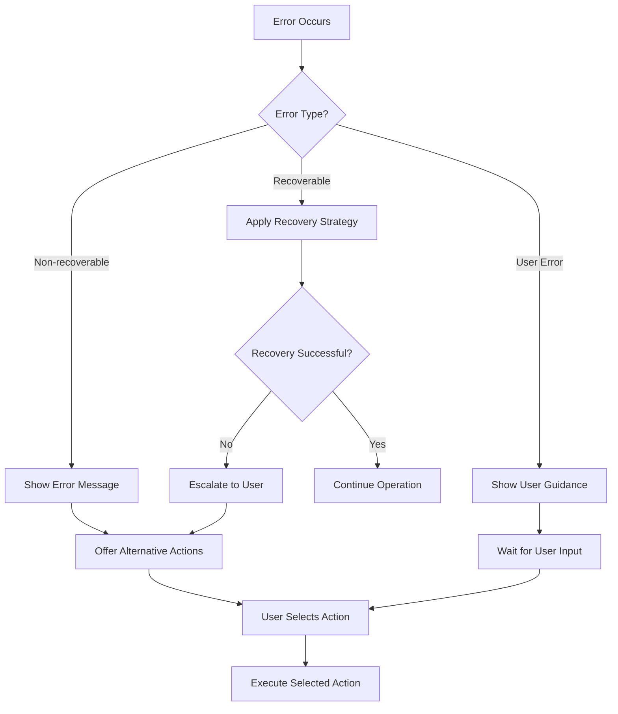

# Design Document

## Overview

This design document outlines the technical approach to fix critical UI interaction issues in the SQLite file browser built with GPUI. The solution focuses on improving page selection reliability, enhancing error handling, implementing robust file watching, optimizing UI responsiveness, and adding comprehensive status messaging and keyboard navigation support.

The design maintains the existing entity-based architecture while introducing new components for status management, keyboard handling, and improved error recovery mechanisms.

## Architecture

### Current Architecture Analysis

The application follows a clean entity-based architecture with:
- **SqliteBrowser**: Main coordinator managing file operations and entity orchestration
- **FileDialogManager**: Handles file selection and opening operations
- **PageGrid**: Manages page visualization and selection
- **PageSidebar**: Displays detailed page information
- **FileManager**: Handles file operations and watching

### Enhanced Architecture

The enhanced architecture introduces several new components while preserving the existing structure:



## Components and Interfaces

### 1. StatusManager

A new component responsible for managing status messages, progress indicators, and user feedback.

**Interface:**
```rust
pub struct StatusManager {
    message_queue: VecDeque<StatusMessage>,
    current_message: Option<StatusMessage>,
    auto_dismiss_tasks: HashMap<StatusId, Task<()>>,
}

pub struct StatusMessage {
    id: StatusId,
    content: String,
    message_type: StatusType,
    dismissible: bool,
    auto_dismiss_after: Option<Duration>,
    requires_acknowledgment: bool,
}

pub enum StatusType {
    Info,
    Success,
    Warning,
    Error,
    Progress(f32), // 0.0 to 1.0
}
```

**Key Methods:**
- `show_message()`: Display a status message
- `show_progress()`: Display progress indicator
- `dismiss_message()`: Manually dismiss a message
- `clear_all()`: Clear all messages
- `queue_message()`: Add message to queue

### 2. KeyboardHandler

Manages keyboard navigation and shortcuts throughout the application.

**Interface:**
```rust
pub struct KeyboardHandler {
    focus_manager: FocusManager,
    key_bindings: HashMap<KeyBinding, Action>,
    navigation_state: NavigationState,
}

pub struct NavigationState {
    current_focus: FocusTarget,
    grid_position: Option<(usize, usize)>,
    selected_page: Option<u32>,
}

pub enum FocusTarget {
    PageGrid,
    Sidebar,
    FileDialog,
    StatusMessage,
}
```

**Key Methods:**
- `handle_key_event()`: Process keyboard input
- `navigate_grid()`: Handle arrow key navigation in page grid
- `execute_shortcut()`: Execute keyboard shortcuts
- `update_focus()`: Manage focus transitions

### 3. Enhanced PageGrid

Improved page grid with better selection handling and visual feedback.

**New Features:**
- Reliable selection state management
- Smooth hover transitions
- Keyboard navigation support
- Virtualization for large datasets

**Interface Additions:**
```rust
pub struct SelectionState {
    selected_page: Option<u32>,
    hover_page: Option<u32>,
    selection_timestamp: Instant,
}

pub struct GridLayout {
    columns: usize,
    visible_range: Range<usize>,
    scroll_position: f32,
}
```

### 4. Enhanced PageSidebar

Improved sidebar with better error handling and loading states.

**New Features:**
- Loading indicators during page detail fetching
- Error state handling
- Smooth transitions between page selections
- Cached page details for performance

**Interface Additions:**
```rust
pub enum SidebarState {
    Empty,
    Loading(u32),
    Loaded(PageInfo),
    Error(String),
}

pub struct PageDetailsCache {
    cache: LruCache<u32, PageInfo>,
    loading_tasks: HashMap<u32, Task<Result<PageInfo>>>,
}
```

### 5. Enhanced FileManager

Improved file management with robust error handling and better watching.

**New Features:**
- Graceful error recovery
- Configurable file watching with retry logic
- Batch processing for large files
- Memory-efficient parsing

**Interface Additions:**
```rust
pub struct WatcherConfig {
    retry_attempts: u32,
    retry_delay: Duration,
    debounce_duration: Duration,
}

pub struct ParseConfig {
    batch_size: usize,
    max_parse_time: Duration,
    enable_cancellation: bool,
}
```

## Data Models

### Status Message Model

```rust
#[derive(Debug, Clone)]
pub struct StatusMessage {
    pub id: StatusId,
    pub content: String,
    pub message_type: StatusType,
    pub timestamp: Instant,
    pub dismissible: bool,
    pub auto_dismiss_after: Option<Duration>,
    pub requires_acknowledgment: bool,
    pub action: Option<StatusAction>,
}

#[derive(Debug, Clone)]
pub enum StatusAction {
    Retry(Box<dyn Fn() + Send + Sync>),
    Dismiss,
    OpenFile,
    ShowDetails,
}
```

### Selection State Model

```rust
#[derive(Debug, Clone)]
pub struct SelectionState {
    pub selected_page: Option<u32>,
    pub hover_page: Option<u32>,
    pub selection_timestamp: Instant,
    pub selection_source: SelectionSource,
}

#[derive(Debug, Clone)]
pub enum SelectionSource {
    Mouse,
    Keyboard,
    Programmatic,
}
```

### File Operation State Model

```rust
#[derive(Debug, Clone)]
pub enum FileOperationState {
    Idle,
    Opening(PathBuf),
    Parsing(PathBuf, f32), // path, progress
    Watching(PathBuf),
    Error(PathBuf, FileError),
}

#[derive(Debug, Clone)]
pub struct FileError {
    pub error_type: FileErrorType,
    pub message: String,
    pub recoverable: bool,
    pub suggested_action: Option<String>,
}
```

## Error Handling

### Error Classification

1. **Recoverable Errors**: File not found, permission issues, temporary I/O errors
2. **Non-recoverable Errors**: Corrupted files, invalid format, out of memory
3. **User Errors**: Invalid file selection, cancelled operations

### Error Recovery Strategies

```rust
pub enum ErrorRecoveryStrategy {
    Retry { max_attempts: u32, delay: Duration },
    Fallback { alternative_action: Box<dyn Fn()> },
    UserIntervention { prompt: String, actions: Vec<ErrorAction> },
    GracefulDegradation { limited_functionality: bool },
}

pub enum ErrorAction {
    Retry,
    SelectDifferentFile,
    ContinueWithoutFeature,
    RestartApplication,
}
```

### Error Handling Flow



## Testing Strategy

### Unit Testing

1. **StatusManager Tests**
   - Message queuing and display
   - Auto-dismiss functionality
   - Message priority handling

2. **KeyboardHandler Tests**
   - Key binding registration and execution
   - Focus management
   - Navigation state transitions

3. **Selection State Tests**
   - Page selection consistency
   - Multi-source selection handling
   - State synchronization

### Integration Testing

1. **File Operation Flow Tests**
   - End-to-end file opening
   - Error recovery scenarios
   - File watching behavior

2. **UI Interaction Tests**
   - Page selection and sidebar updates
   - Keyboard navigation flows
   - Status message display and dismissal

### Performance Testing

1. **Large Database Handling**
   - Memory usage with thousands of pages
   - UI responsiveness during parsing
   - Virtualization effectiveness

2. **File Watching Performance**
   - Resource usage during active watching
   - Response time to file changes
   - Memory leaks in long-running sessions

## Implementation Phases

### Phase 1: Core Infrastructure
- Implement StatusManager
- Add KeyboardHandler foundation
- Enhance error handling in FileManager

### Phase 2: UI Improvements
- Improve PageGrid selection reliability
- Enhance PageSidebar with loading states
- Add progress indicators

### Phase 3: Advanced Features
- Implement keyboard navigation
- Add file watching improvements
- Optimize performance for large files

### Phase 4: Polish and Testing
- Comprehensive error handling
- Performance optimizations
- Accessibility improvements

## Performance Considerations

### Memory Management

1. **Page Data Caching**: LRU cache for page details to balance memory usage and performance
2. **Lazy Loading**: Load page details only when needed
3. **Resource Cleanup**: Proper disposal of file watchers and background tasks

### UI Responsiveness

1. **Batch Processing**: Process large datasets in chunks to avoid blocking the UI
2. **Background Tasks**: Move heavy operations to background threads
3. **Debouncing**: Debounce rapid file changes to avoid excessive reloading

### Rendering Optimization

1. **Virtualization**: Render only visible page squares for large databases
2. **Efficient Updates**: Minimize re-renders by tracking state changes precisely
3. **Smooth Animations**: Use GPUI's animation system for smooth transitions

## Security Considerations

1. **File Access**: Validate file paths and permissions before operations
2. **Resource Limits**: Implement limits on file size and parsing time
3. **Error Information**: Avoid exposing sensitive system information in error messages
4. **Input Validation**: Validate all user inputs and file contents

This design provides a robust foundation for addressing all the identified UI interaction issues while maintaining the existing architecture's strengths and ensuring scalability for future enhancements.